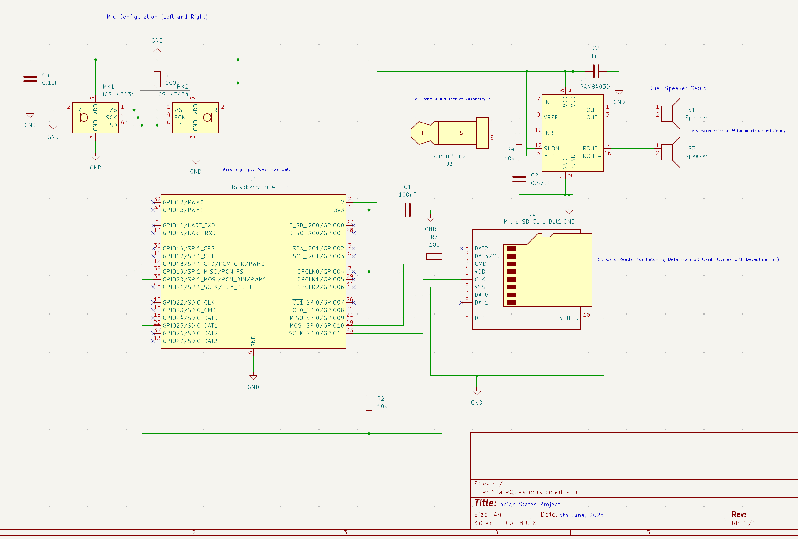

# 🎙️ Voice Controlled Smart Audio Responder

> Mic → RPi (NLP + ML) → Speaker  
> Ask a question out loud — get the answer spoken back.

---

##  Project Summary

This project implements a complete voice-based query-response system using a **Raspberry Pi 4**, **stereo microphones**, **an SD card reader**, and **dual speaker output**.

###  How It Works

```text
Mic Input → PAM8403 Mic Amp → Raspberry Pi 4
                            ↓
                      Speech-to-Text
                            ↓
                     NLP (Spell Correction)
                            ↓
          ML Model (Predicts SD Card Index)
                            ↓
                    Text-to-Speech (TTS)
                            ↓
               Output via Speaker Amplifier
```

The system captures audio from a **dual-microphone array**, uses **speech recognition** and **NLP** to parse the question, then feeds it to a **machine learning model** which predicts an index into an SD card file. The Pi then reads the corresponding content and plays it back using **text-to-speech**, routed to **stereo speakers**.

---



## How to view the schematic? 
- Clone the repository using git 
```Bash 
git clone https://github.com/mahib1/Indian-States-Project.git ISP && cd ISP/kiCAD 
```

- After this, Just open up KiCad, select "Open an existing project", Navigate to the kiCAD Directory in the Reposirotry, and select the .pro file!

- The Schematic file will appear as a .sch file and you can click on it to view it!

##  Hardware Block Diagram

- **ICS-43434 I²S Microphones**
  - Configured in TDM mode (Left & Right)
  - Audio streamed via I²S to Raspberry Pi

- **Raspberry Pi 4**
  - Captures audio from mics
  - Performs STT, NLP correction, ML inference, and TTS
  - Controls SD card (via SPI) and speaker output

- **PAM8403 Stereo Amplifier**
  - Drives 2x speakers
  - Audio input from Pi (TTS)

- **Micro SD Card**
  - SPI connected to Pi
  - Stores data or pre-recorded content
  - Detect pin wired for card presence

---

##  Schematic Overview

Key components:
- **J1:** Raspberry Pi header
- **MK1/MK2:** ICS-43434 microphones
- **J2:** SD card breakout (SPI)
- **U1:** PAM8406D amplifier
- **J3:** 3.5mm Audio Plug
- **LS1/LS2:** Stereo speaker outputs


---

##  Software Requirements

- Python 3.9+
- `speechrecognition`
- `transformers`
- `scikit-learn` or `tensorflow`
- `pyttsx3` or `espeak`
- `spidev`
- `RPi.GPIO` (or `gpiozero`)

---

##  How to Run

1. Connect the hardware as per the schematic.
2. Power the Pi (via USB-C or regulated GPIO).
3. Insert a correctly formatted SD card with response content.
4. Run the script

---

##  To-Do / Improvements

- [ ] Add proper level shifting to SD card interface
- [ ] Use I²S audio output instead of analog 3.5mm

---

##  License

MIT License
---

##  Made With  Using:
- KiCad 8.0
- Raspberry Pi 4

